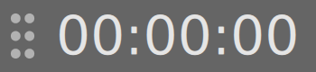

# Micro-timer for Linux



Very simple interface:

- One-click to start/stop the timer
- Double-click to clear the timer
- Right-click to open a context menu -> About, Close

Enjoy!

## Install from snap

```
snap install micro-timer
```

## Compile on Ubuntu

```
apt-get install cmake qtbase5-dev qtdeclarative5-dev qml-module-qtquick-controls qml-module-qtquick-controls2 qtquickcontrols2-5-dev
mkdir build && cd build
cmake ..
make
```

Then run with

```
./micro-timer
```
